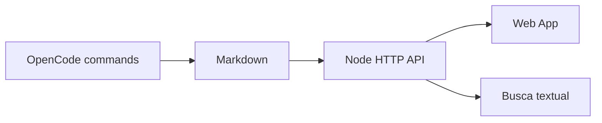

# Arquitetura

O MVP usa um servidor Node.js nativo, sem framework ou banco externo. Markdown é a fonte de verdade; o servidor indexa `knowledge/` e `projects/` em cada consulta. Isso reduz operação e mantém exportação/backup trivial.

Não há autenticação na primeira versão. A fronteira de segurança é a rede/proxy: rode localmente ou atrás de VPN, basic auth/OIDC e TLS. SQLite, embeddings, fila e search engine ficam adiados até volume real justificar.

## Evolução baseada no ambiente existente

Komodo, Traefik, Tailscale e o gateway de notificações Duda podem ser conectados depois por adaptadores read-only. O fluxo recomendado é: aplicação publica um evento sanitizado, Duda deduplica e entrega a notificação; nenhuma credencial ou log bruto passa pela Knowledge Base. Deploy de produção e ações destrutivas continuam exigindo aprovação humana.
