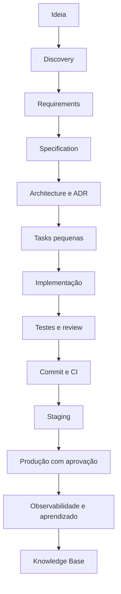

# Workflow de Engenharia

Cada fase tem um artefato verificável. Discovery aprovado é o checkpoint 1; specification, architecture, feature testada, staging e produção são checkpoints seguintes. Mudanças de escopo viram `templates/change-request.md` antes de virar código.

Para projetos pessoais, use GitHub Flow: `main` protegida, branches curtas, PR quando houver revisão útil e tags SemVer para releases. Git Flow só é justificado quando há manutenção paralela de versões.
